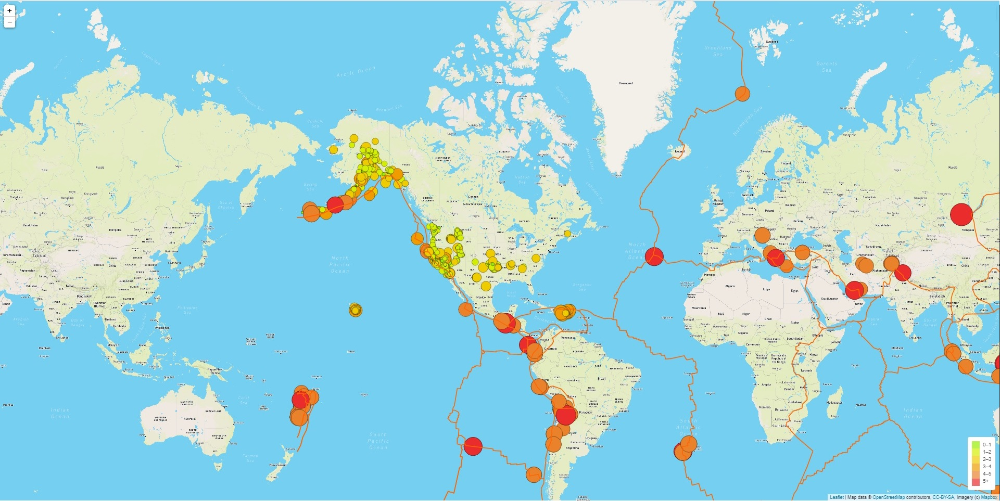
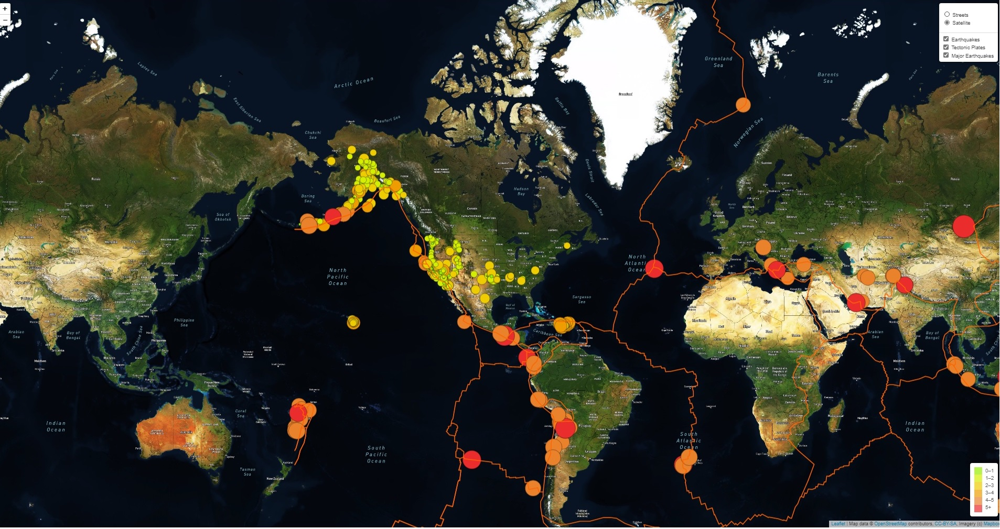
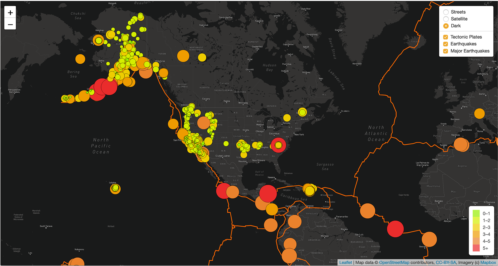

# Mapping_Earthquakes

# Purpose

**Background**

Basil and Sadhana like how you created your earthquake map with two different maps and the earthquake overlay. Now, Basil and Sadhana would like to see the earthquake data in relation to the tectonic plates’ location on the earth, and they would like to see all the earthquakes with a magnitude greater than 4.5 on the map, and they would like to see the data on a third map.

**Purpose**
To Add Tectonic Plate Data, Major Eathquake Data, and provide an additional map for the costumer.

# Deliverable 1: Add Tectonic Plate Data

**Deliverable 1 Requirements**

1.1. The tectonic plate data is added as a second layer group

1.2. The tectonic plate data is added to the overlay object

1.3. The d3.json() callback is working and does the following:
  - The tectonic plate data is passed to the geoJSON() layer
  - The geoJSON() layer adds color and width to the tectonic plate lines
  - The tectonic layer group variable is added to the map

1.4. The earthquake data and tectonic plate data displayed on the map when the page loads

# Deliverable 2: Add Major Earthquake Data

**Deliverable 2 Requirements**

2.1. The major earthquake data is added as a third layer group

2.2. The major earthquake data is added to the overlay object

2.3. The d3.json() callback is working and does the following:
  - Sets the color and diameter of each earthquake.
  - The major earthquake data is passed to the geoJSON() layer.
  - The geoJSON() layer creates a circle for each major earthquake, and adds a popup for each circle to display the magnitude and location of the earthquake
  - The major earthquake layer group variable is added to the map

2.4. All the earthquake data and tectonic plate data are displayed on the map when the page loads and the datasets can be toggled on or off

# Deliverable 3: Add an Additional Map

**Deliverable 3 Requirements**

3.1. A third map tile layer is created

3.2. The third map is added to the overlay object

3.3. All the earthquake data and tectonic plate data are displayed on the all maps of the webpage

